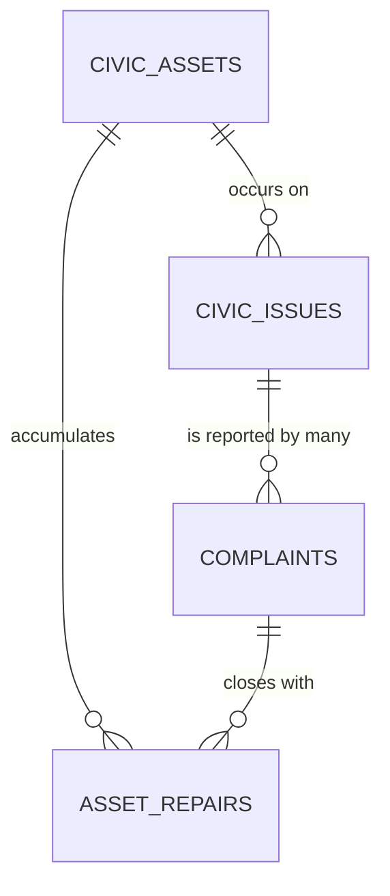
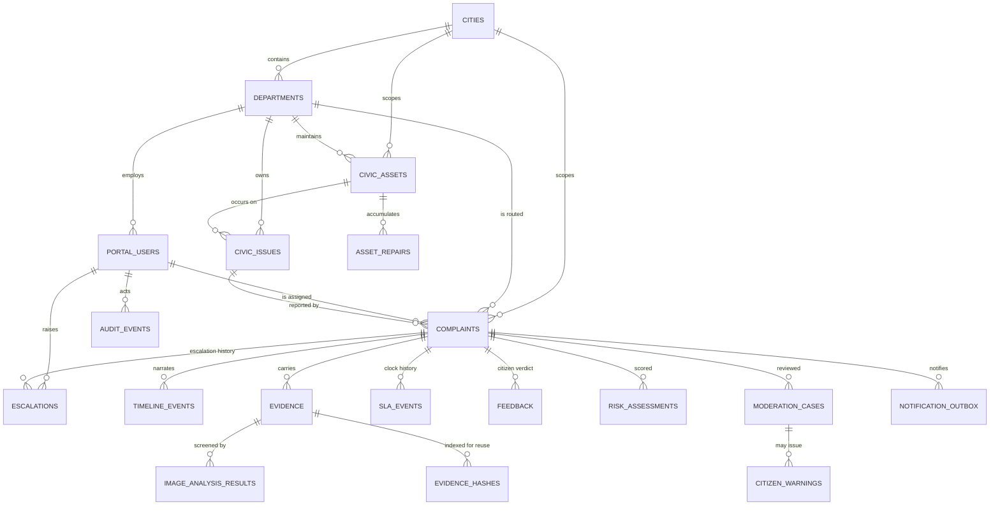

# JAN-SEVA — Entity Relationship Diagram

Describes the schema in `supabase/migrations/`. **Never deployed** — see
[DATABASE.md](DATABASE.md) for what that means.

## The core relationship

The one worth understanding before the rest: a **civic issue** is the
pothole; a **complaint** is one person telling you about it.



Three citizens, one pothole:

```
civic_issues:  GWL-RD-0142  ─┬─ complaints: JS-GWL-2026-001284
                             ├─ complaints: JS-GWL-2026-001291
                             └─ complaints: JS-GWL-2026-001305
```

One repair. Three independent citizen verifications. A department cannot
close all three by satisfying one of them.

## Full schema



## Reading the boundaries

**Citizen ← → record.** There is no `citizens` entity. `complaints`
carries an opaque `identity_reference` digest and a display mask. The
line from a person to their reports exists only while
`identity_expires_at` has not passed.

**Timeline ≠ audit.** `TIMELINE_EVENTS` is what the citizen reads.
`AUDIT_EVENTS` is what an investigator reads. An internal note never
crosses into the first.

**Claim ≠ confirmation.** `complaints.resolved_at` is the department's
claim. `FEEDBACK.response` is the citizen's answer. Nothing derives the
second from the first.

**Signal ≠ decision.** `IMAGE_ANALYSIS_RESULTS` and `RISK_ASSESSMENTS`
hold what a model measured. `MODERATION_CASES` holds what a human
decided. No punitive row is keyed to a probability alone.

## Not modelled

`work_orders` (spec §18). Work state currently lives on `complaints`
(`assigned_to`, `status`, `sla_due_at`). Introducing a work order keyed
to `civic_issue_id` — so one repair serves N reports — means moving that
state off `complaints`, which changes every query that reads it. Flagged
in `0007_sla_escalation_feedback.sql`, not guessed at.
