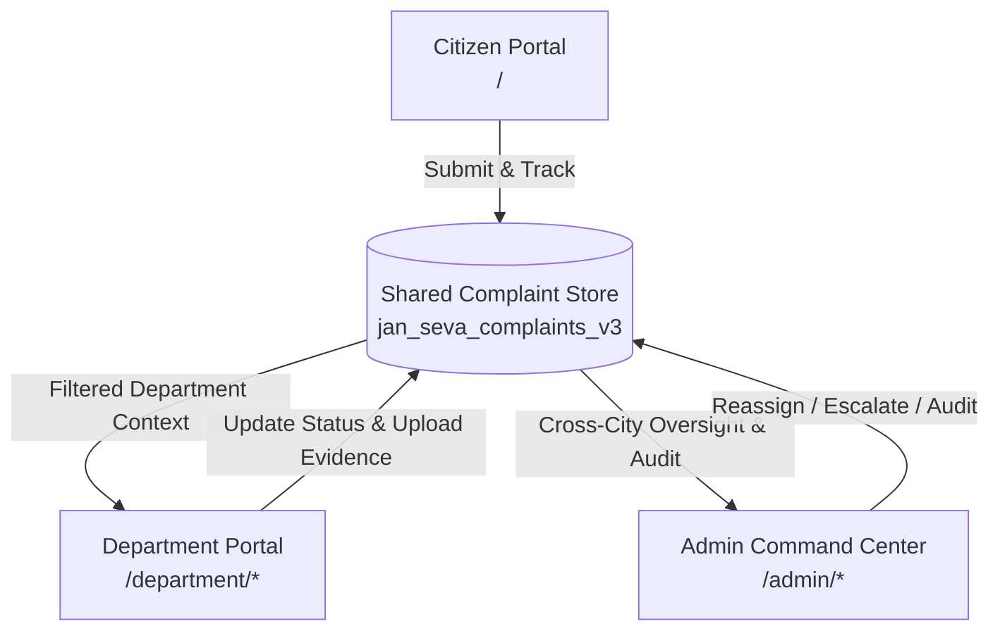

<div align="center">

# 🏛️ JAN-SEVA (जन-सेवा)
### *Aapki Samasya, Hamari Jimmedari (आपकी समस्या, हमारी ज़िम्मेदारी)*

[](https://react.dev/)
[](https://www.typescriptlang.org/)
[](https://vitejs.dev/)
[](https://developer.mozilla.org/en-US/docs/Web/CSS)
[](LICENSE)

**An enterprise-grade, transparent, and AI-assisted Civic Grievance Redressal & Operations Management Ecosystem.**  
*Currently powering municipal services in **Gwalior, Madhya Pradesh**, with upcoming expansions to **Indore** and **Bhopal**.*

---

[Explore Features](#-key-capabilities) • [Architecture](#-three-tier-architecture) • [Getting Started](#-getting-started) • [Demo Personas](#-demo-personas--quick-access) • [Privacy & Security](#-privacy--statutory-compliance)

</div>

---

## 🌟 Executive Overview

**JAN-SEVA** is a modern civic governance platform that bridges the gap between citizens, municipal field departments, and city administrators. By replacing bureaucratic silos with real-time tracking, dual-location GPS intelligence, automated SLA escalations, and cross-department oversight, JAN-SEVA delivers guaranteed accountability in municipal service delivery.

---

## 🏗️ Three-Tier Architecture



---

## 🧭 Product thesis

**JAN-SEVA is a proof-of-work record for municipal maintenance.** It turns each citizen report into an evidence-bound job against a named piece of city infrastructure — and refuses to call it finished until the evidence is verifiable, everyone who reported it agrees, and the asset itself has not failed again.

Every Indian civic platform competes on *intake* — who makes it easiest to complain. Swachhata-MoHUA already won that race across 4,900+ cities, and CPGRAMS NextGen is extending it with WhatsApp filing and a voice chatbot. This product does not compete there and does not claim to. It competes on **proof**: whether the work was actually done.

Three consequences shape the build:

* **The AI is optional.** Delete the classifier and every signature feature still works — Proof of Repair is device policy, geometry and hashing; the asset ledger is a join and a date comparison; work batching is a greedy heuristic; the quality score is arithmetic; the issue/report split is a schema.
* **The moat is time.** Verification screens are copyable in a sprint. A repair history against real assets is not, because a competitor's ledger starts empty on day one.
* **What we deliberately did not build.** No IoT, no blockchain evidence anchoring, no public department leaderboard with rewards, no public citizen karma scores, no social-media ingestion, no Aadhaar mandate, no gamification, and no predictive maintenance model. Each was considered and rejected on evidence — predictive civic models trained on complaint data have failed field validation, and ranked public-service targets have a documented history of being gamed.

---

## 🚀 Key Capabilities

### 1. 👥 Citizen Experience (`/`, `/report`, `/track`)
* **60-Second Report Wizard**: 4-step streamlined grievance submission with photo evidence capture, real-time file validation, and description suggestions.
* **Dual Location Intelligence**: Captures both *Device GPS coordinates* and *Citizen-Confirmed Issue Location* on an interactive map.
* **Keyword Classification & Routing**: Priority scoring (0–100) and department routing (PWD, Sanitation, Water, Electrical, Infra) matched from the description across all categories, with confidence derived from the margin over the runner-up. This is weighted keyword matching, not a model — photos are not analysed, and the citizen confirms the category before submitting. Every signature feature below works with the classifier deleted.
* **Voice input (Hindi & English)**: Dictate the complaint instead of typing it. Browser ASR today; Bhashini is the production path.
* **Live Complaint Tracker (`/track`)**:
  * Real-time timeline nodes showing verified field updates.
  * Before & after photographic resolution evidence gallery.
  * **Citizen Resolution Verification**: Citizens confirm whether the issue was fixed or request a reinspection.
  * Printable official complaint receipt.
* **Proof of Repair (citizen view)**: The department's closing photo carries a capture-integrity grade — taken live in-app, at the reported location, on an unspoofed device, never submitted before — visible on the tracking timeline with the individual checks.
* **Deferred verification**: Confirmed fixes are re-checked at 30 and 90 days. Two prompts, one tap each, never a third.
* **Live impact statistics**: Counters derived from the complaint store on every read — issues tracked, *citizen-verified* fix rate, and repeat failures caught. Municipal programme totals are shown separately and labelled illustrative.
* **City Expansion Ready**: City selector dropdown supporting **Gwalior** (Active • Default), **Indore** (Coming Soon), and **Bhopal** (Coming Soon).

---

### 2. 🏢 Department Operations Ecosystem (`/department/*`)
* **5 Dedicated Municipal Configurations**:
  * 🛣️ **Public Works Department (PWD)** — Potholes & road surface repairs
  * 🧹 **Municipal Sanitation** — Waste collection, open dumping, and compactor dispatch
  * 🚰 **Public Health & Water Works (PHE)** — Pipeline leaks, contamination, and water supply outages
  * 💡 **Municipal Electrical Division** — Streetlights, dark spots, and exposed utility wiring
  * 🏗️ **Public Infrastructure** — Damaged railings, parks, pavements, and public property
* **Locked Department Context**: Secure session locking preventing unauthorized cross-department data tampering.
* **Operational Dashboard**: Backlog management, unassigned grievance triage, and SLA countdown trackers.
* **Field Task Assignment**: Assign field engineers and operational maintenance teams with single-click workflow.
* **One-Trip Work Card**: Nearby open jobs of the same skill batched into a single routed trip, delivered offline-first to the officer's phone with what to capture at each stop. Greedy nearest-neighbour over straight-line distance — a heuristic, described as one.
* **Proof of Repair (capture)**: Evidence camera only. Location, device clock and a perceptual hash are bound at the shutter; a photo that fails a blocking check cannot be submitted at all.
* **Repeat-failure warning**: An officer opening a complaint is told first whether that asset has failed before, and whether the previous repair is still inside its defect liability period.
* **Independent re-inspection**: A fixed share of citizen-confirmed closures is sampled for a second look by an officer who did not do the work. Self-audit is refused in the mutation layer, not by procedure.
* **Resolution Quality Score**: Rebuilt on outcomes rather than closure speed — citizen-verified resolutions 22, durability at 30/90 days 18, repeat-failure rate 16, evidence integrity 14, SLA compliance 12, workload-normalised backlog 10, speed 5 (capped), satisfaction 3 (capped). Reasons are published alongside the number, and components with no data are excluded rather than assumed.

---

### 3. 🏛️ Admin Command Center (`/admin/*`)
* **Weighted Civic Health Score (0–100)**: City-wide composite metric derived from department performance, SLA compliance, resolution rate, citizen satisfaction, backlog ratio, and escalations.
* **8 Executive City KPIs**:
  * Total Influx, Active, Resolved, Escalated
  * SLA Compliance % (vs. 90% benchmark)
  * Average Citizen Satisfaction (Stars)
  * Average Resolution Time (Hours)
  * **Resolution Verification Rate & Resolutions Pending Citizen Confirmation**
* **Explicit "Needs Attention" Radar**: Severity-tagged items sorted by urgency (Critical, High, Medium, Low).
* **Cross-Department Grievance Monitor (`/admin/complaints`)**:
  * Multi-dimensional filtering by department, priority, status, locality, and SLA state.
  * **Cross-Department Reassignment**: Transfer misrouted complaints with audit reasoning.
  * **Manual Administrative Escalation**: Escalate critical bottlenecks directly to the Municipal Commissioner.
* **Separate Admin Audit Log**: Immutable record of all administrative decisions, isolated from citizen-facing public timelines.
* **City-Wide Civic Map & Hotspots Radar (`/admin/map`)**: Real-time geographic pins with locality clustering (City Centre, Thatipur, Lashkar, Morar, Phool Bagh).
* **SLA & Escalation Center (`/admin/escalations`)**: Tabbed monitoring for Breached, At-Risk (<8h), Escalated, and Citizen Reinspection Requests.
* **Performance Trends & Analytics (`/admin/performance`)**: 7d, 30d, 90d longitudinal SVG bar charts comparing complaint influx vs resolution velocity.
* **Civic Initiatives & Print Reports (`/admin/initiatives` & `/admin/reports`)**: Manage ward modernization missions and export printable municipal digests.
* **Civic Asset Ledger (`/admin/assets`)**: Complaints anchored to infrastructure — road segments, poles, drain nodes, bin points — with every repair on the asset's permanent record. Surfaces repeat failures, and flags those inside a contractor's defect liability period as recoverable warranty claims rather than new municipal expense. Contractor attribution is internal-only and never published.
* **Pre-Monsoon Positioning**: A ranked desilting and resurfacing list built from what actually failed in past monsoon months and what has been done since. A query over the record, not a forecast — and labelled as one.
* **Ward Reality Index (`/admin/wards`)**: Complaint volume normalised by ward population and estimated access, plus the screen nobody builds — **Silent Wards**, areas reporting far below expectation, flagged as an attention item rather than as good performance. Explicitly illustrative: the covariates are seeded, and the UI says so.
* **Escalation Ladder**: Escalation levels modelled as named *posts* with their own response windows and visible queues, not as a string in a timeline. Public exposure of a post's backlog is a per-city configuration decision, defaulting to off above Level 1.
* **Open Civic Record (`/admin/open-data`)**: The complaint and asset-repair record as Open311 GeoReport v2, downloadable. Personal data is absent by construction — the feed is built from the `PublicComplaint` projection, which has no `reporter` field, so the compiler prevents a leak. Coordinates, photographs, contractor names and works costs are all deliberately excluded.

---

## 🔒 Privacy & Statutory Compliance

JAN-SEVA adheres to statutory standards (Digital Personal Data Protection Act):
* **Zero Raw Aadhaar Exposure**: Aadhaar numbers and mobile numbers are cryptographically derived and masked (`+91 XXXXX 43210`).
* **Minimum Necessary Principle**: Administrative access to citizen contact details is restricted and masked across all portals.
* **Dual Timeline Isolation**: Public grievance updates and internal administrative audit logs remain completely separated.
* **Type-Enforced Public Projection**: `PublicComplaint` has no `reporter` field. A component rendering a public view — or the Open311 feed — cannot leak identity even by accident, because the compiler refuses it.
* **Split retention**: **Identity** expires 48 hours after resolution; the **civic record does not.** What was broken, where at locality granularity, which department answered for it, whether the evidence was verified and whether the fix held is a record about public infrastructure and public money, and it is permanent. Archival only ever *removes* — the named officer, the photographs and the timeline all go. This split is what lets the product answer "has this been fixed before?", which the previous 48-hour delete made impossible.

> **On the hashing.** `deriveIdentityReference` is FNV-1a, not a real KDF. It is adequate for a demo and is not adequate for production; a deployment needs a keyed KDF with a server-held secret. Said here rather than left to be discovered.

---

## 🛠️ Technology Stack

| Layer | Technologies |
|---|---|
| **Core Framework** | React 19, TypeScript 5.7 |
| **Build & Dev Tool** | Vite 6 |
| **Routing** | React Router v7 |
| **Styling** | Vanilla CSS3 Design System with CSS Tokens, Glassmorphism, and HSL palettes |
| **Animations** | `requestAnimationFrame` + `IntersectionObserver` with Quartic Ease-Out |
| **Data Layer** | Reactive LocalStorage Repository with Cross-Tab Storage Event Sync |
| **Quality & Linting** | Strict TypeScript, Zero Compilation Errors |

---

## 📂 Codebase Structure

```
jan-seva/
├── public/                     # Static assets, branding marks, and city imagery
├── src/
│   ├── components/
│   │   ├── Admin/              # Phase 5: Admin Command Center
│   │   │   ├── Dashboard/      # Civic Health Score, KPIs, Needs Attention
│   │   │   ├── Complaints/     # Grievance Monitor & Inspector with Audit Log
│   │   │   ├── Departments/    # Department Ranking Scorecards & Drill-downs
│   │   │   ├── Map/            # City-Wide GIS Map & Hotspot Radar
│   │   │   ├── Escalations/    # SLA Breaches & Reinspection Oversight
│   │   │   ├── Feedback/       # Citizen Sentiment & Verification Analytics
│   │   │   ├── Performance/    # Longitudinal SVG Trend Charts
│   │   │   ├── Initiatives/    # Civic Campaign Manager
│   │   │   └── Reports/        # Print-ready Municipal Digests
│   │   ├── Department/         # Phase 4: Department Operations Ecosystem
│   │   │   ├── Dashboard/      # Department KPI Cards & SLA Health
│   │   │   ├── Complaints/     # Complaint Queue & Action Modal
│   │   │   ├── MyWork/         # Officer Assigned Work Inspector
│   │   │   ├── Map/            # Department Ward Radar
│   │   │   └── Performance/    # Department Tier & Scorecard
│   │   ├── Header/             # Brand Lockup, City Selector (Gwalior, Indore, Bhopal)
│   │   ├── Hero/               # Hero Headline & Cinematic Count-Up Trust Bar
│   │   ├── ReportWizard/       # 4-Step Citizen Grievance Reporting Wizard
│   │   ├── TrackComplaint/     # Real-Time Tracking & Verification
│   │   └── ui/                 # Reusable Design System Buttons, Icons & Badges
│   ├── data/                   # Department configurations, navigation, seed data
│   ├── hooks/                  # Custom hooks (useCountUp, useCityConfig, useGeolocation)
│   ├── services/               # AdminService, ComplaintService, PerformanceService, AuthService
│   ├── styles/                 # Global tokens, typography, animations, icons
│   ├── types/                  # Strict TypeScript interfaces (Complaint, Admin, Department)
│   ├── App.tsx                 # Master Routing Setup
│   └── main.tsx                # Application Entry Point
├── package.json
├── tsconfig.json
└── vite.config.ts
```

---

## 💻 Getting Started

### Prerequisites
* **Node.js** (v18.0.0 or higher)
* **npm** (v9.0.0 or higher)

### Installation & Run

1. **Clone the repository:**
   ```bash
   git clone https://github.com/devbrat-sharma-17/jan-seva.git
   cd jan-seva
   ```

2. **Install dependencies:**
   ```bash
   npm install
   ```

3. **Start the local development server:**
   ```bash
   npm run dev
   ```
   Open [http://localhost:5173](http://localhost:5173) in your browser.

4. **Build for production:**
   ```bash
   npm run build
   ```

5. **Run the headless service self-test:**
   ```bash
   npm run selftest
   ```
   Runs the real service layer in Node — the shared repository, department
   scoping, the audit trail, the offline queue, the derived metrics, and the
   capture-integrity, asset-ledger, distributed-consent, work-card and
   Open311 paths. **187 assertions**, including the ones worth checking every
   time: that a gallery upload cannot close a complaint, that a reused photo
   is refused, that an archived record keeps no officer or photograph, that
   one confirmation cannot close a two-reporter issue, and that no reporter
   name or coordinate can reach the public data feed, and that a city
   with nothing filed reports no resolution rate rather than 0% or 100%.

---

## 🔑 Demo Personas & Quick Access

You can explore all three portals immediately using the built-in **Quick Demo** selectors:

| Role | Portal URL | Demo Persona | Credentials / Quick Access |
|---|---|---|---|
| **Citizen** | `/` or `/report` | Raj Sharma / Anjali Gupta | OTP Simulation (e.g. `9876543210`) |
| **Department Officer** | `/department/login` | Er. Ramesh Verma (PWD) / Anita Sharma (Sanitation) | Select department & click **Quick Demo Login** |
| **City Administrator** | `/admin/login` | Dr. Rakesh Agrawal (City Administrator) | Click **Enter as City Administrator** |

---

## 📜 License

This project is licensed under the **MIT License** — see the [LICENSE](LICENSE) file for details.

---

<div align="center">
  <sub>Built with ❤️ for Citizen Empowerment and Transparent Civic Governance.</sub>
</div>
